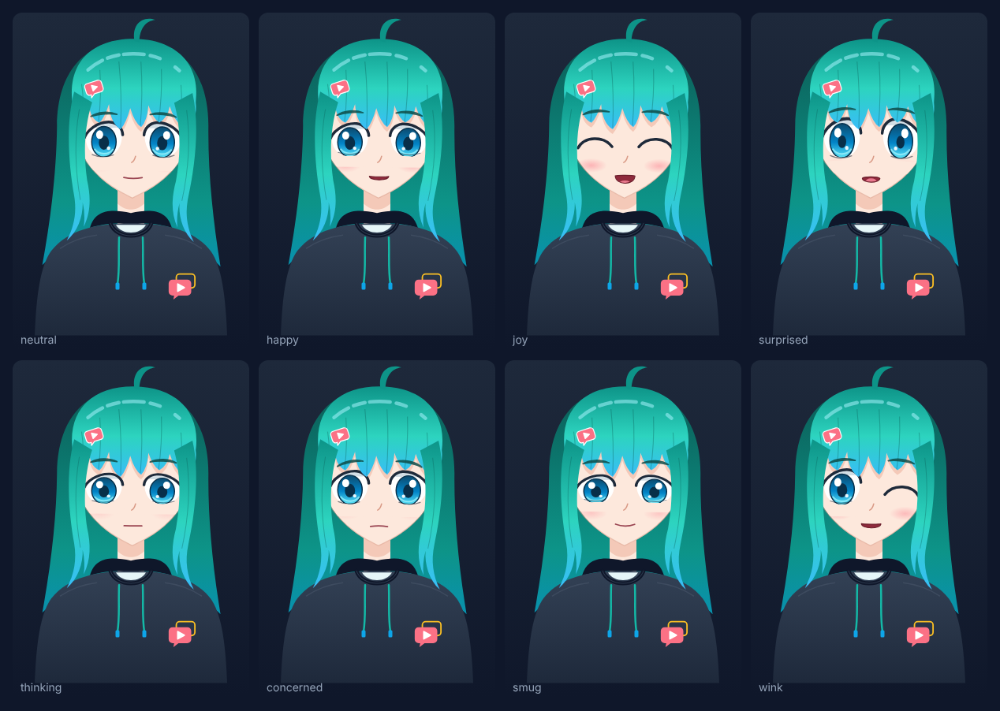
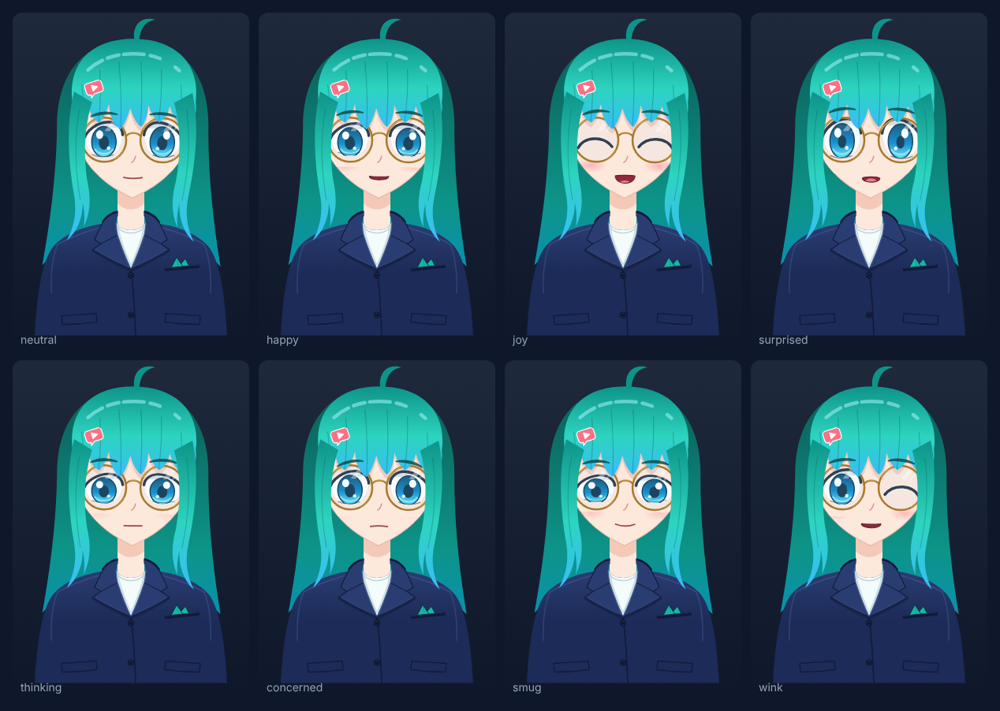

# avatars

Instructor avatars, scenes and a design system for tutorial videos that are
plain text files: a narration script and a chain of scene calls, voiced by a
local speech model and rendered on a CPU with
[HyperFrames](https://github.com/heygen-com/hyperframes). Every frame is a
pure function of time, so a video renders the same anywhere and renders again
whenever its source changes. The library is for projects whose documentation
wants short screencast-and-slides videos that coding agents can write, check
and keep up to date: a project references it by git tag and keeps only its
brand, pronunciations, episodes and checks.

| Sindy in the `hoodie` look | Sindy in the `blazer-glasses` look |
| --- | --- |
|  |  |

## Quick start

You need Node.js 22 or later, Python 3.10 to 3.13 for the voice, FFmpeg with
libx264 and a Chrome that HyperFrames can drive. Create a project from the
template; its `package.json` depends on the library by tag,
`"@dennisklein/avatars": "github:dennisklein/avatars#semver:^0.1"`:

```bash
npx --yes --package github:dennisklein/avatars#semver:^0.1 avatars new project my-videos
cd my-videos
npm install
```

Once per machine, set up the voice and the browser:

```bash
python3 -m venv .venv
. .venv/bin/activate                    # in every new shell
pip install -r node_modules/@dennisklein/avatars/voice/requirements.txt
npx avatars voice-setup                 # the speech model, about 350 MB
npx hyperframes browser ensure          # the browser HyperFrames renders with
```

The project has an example episode, `episodes/hello/`, and a placeholder
brand in `brand/`: replace its marks and its short `wordmark` with your own.
Make your first episode, then voice, check, render and publish it:

```bash
npx avatars new episode first-steps     # episodes/first-steps/: script.json, index.html
npx avatars phonemes first-steps --flagged   # words the voice may get wrong
npx avatars voice first-steps           # narration, cached line by line
npx avatars check first-steps           # timeline, warnings, contact sheets in snapshots/
npx avatars render first-steps --draft  # renders/first-steps.mp4
npx avatars publish first-steps         # web MP4, poster, WebVTT captions and a manifest
```

`npx avatars fixture-voice first-steps` gives an episode made-up timings
without the speech model, which is enough for `check` while you lay out
scenes; `render` and `publish` need the real voice.
[docs/authoring.md](docs/authoring.md) explains how to write an episode and
[docs/pipeline.md](docs/pipeline.md) how to publish it on a docs site and
render it in CI.

## Concepts

| Concept | What it is | Guide |
| --- | --- | --- |
| Episode | `script.json` (the narration, one line per beat) and `index.html` (a chain of scene calls) | [authoring](docs/authoring.md) |
| Scene | a builder method that lays out one part of an episode: `intro`, `talk`, `slide`, `diagram`, `code`, `terminal`, `outro` | [authoring](docs/authoring.md) |
| Token, theme, format | named design values in tiers; a theme (`midnight`, `daylight`) sets the semantic ones, a format the canvas and layout | [design system](docs/design-system.md) |
| Brand | a project's name, wordmark, marks, links and token overrides | [design system](docs/design-system.md) |
| Avatar, look, part | an instructor drawn from parts on a base, dressed in looks | [avatars](docs/avatars.md) |
| Performer, pose | narration timings, moods, gaze and gestures turned into numbers per frame | [avatars](docs/avatars.md) |
| Voice preset, lexicon | how an avatar sounds and how words are pronounced | [voice](docs/voice.md) |
| Project | `avatars.json`, brand, lexicon, checks and episodes, outside this repository | [pipeline](docs/pipeline.md) |

[DESIGN.md](DESIGN.md) is the contract: file formats, runtime namespaces,
the pose, slots, tokens, project configuration and the CLI.
[docs/pitfalls.md](docs/pitfalls.md) lists known problems and their fixes,
and [docs/background.md](docs/background.md) why the avatar is a code-drawn
SVG rig.

## The `avatars` command

| Command | Does |
| --- | --- |
| `new project DIR`, `new episode ID` | a project or an episode from the templates |
| `voice ID`, `phonemes ID`, `fixture-voice ID`, `voice-setup` | narration and pronunciation |
| `check ID [--quick]` | timeline, warnings, stale narration, grounding, lint and contact sheets |
| `render ID [--draft]` | an MP4 with burned-in captions |
| `publish ID` | web MP4, poster, WebVTT captions and a manifest for a docs site |
| `hash ID`, `ci ID --store DIR` | the render hash; render only what changed |
| `vendor ID`, `lint ID`, `validate` | the vendored bundle, HyperFrames lint, schema validation |
| `sheet AVATAR -o PNG`, `gallery --out DIR` | avatar sheets and the catalogue of the library |

`--all` instead of an episode id runs a command for every episode, and
`npx avatars help` lists every option. [docs/pipeline.md](docs/pipeline.md)
describes each command.

## Repository layout

```text
core/            runtime of every episode, component tokens, JSON Schemas
tokens/          primitive tokens
themes/          midnight, daylight
formats/         landscape-1080p
icons/           icon packs core and tech
scenes/          intro, talk, slide, diagram, code, terminal, outro
rigs/svg/        the SVG rig and the anime-600x800 base
parts/           identity and wardrobe parts
avatars/sindy/   the avatar Sindy: avatar.json, CHARACTER.md, voice, lexicon, looks
voice/           the text-to-speech tool (Python, Kokoro-82M)
lexicons/        pronunciation packs en-us/core and en-us/hpc
cli/             the avatars command and tools
templates/       project and episode templates
examples/demo/   a complete project with the episodes tour and wardrobe
gallery/         the pages of avatar sheets and the gallery
integrations/    Hugo shortcode, GitHub Actions composite action, Claude Code plugin
skills/          Claude Code skills
docs/            guides
test/            Node test suites
```

## Claude Code plugin

This repository is a Claude Code plugin marketplace whose plugin `avatars`
ships three skills: `avatars-episode` (make or update an episode),
`avatars-voice` (narration and pronunciation) and `avatars-design` (work on
the library). A project enables them for everyone with this
`.claude/settings.json`, pinned to the tag its `package.json` uses:

```json
{
  "extraKnownMarketplaces": {
    "avatars": {
      "source": { "source": "github", "repo": "dennisklein/avatars", "ref": "v0.1.0" }
    }
  },
  "enabledPlugins": {
    "avatars@avatars": true
  }
}
```

The skills then appear as `/avatars:avatars-episode` and so on;
[integrations/claude-code/README.md](integrations/claude-code/README.md) has
the details.

## Working on the library

```bash
npm ci
npm test                                               # Node test suites
npm run test:voice                                     # the voice tool's Python tests
node cli/avatars.mjs validate                          # every manifest against its schema
node cli/avatars.mjs fixture-voice --all --project examples/demo
node cli/avatars.mjs check --all --quick --project examples/demo
npm run gallery                                        # gallery/out/index.html
```

`CLAUDE.md` has the rules and commit conventions, and the `avatars-design`
skill the procedures for changing avatars, parts, themes and scenes.

## Licence

Code, artwork and characters are licensed under the
[Apache License 2.0](LICENSE), copyright Dennis Klein. [NOTICE](NOTICE) lists
the third-party software the library installs.
